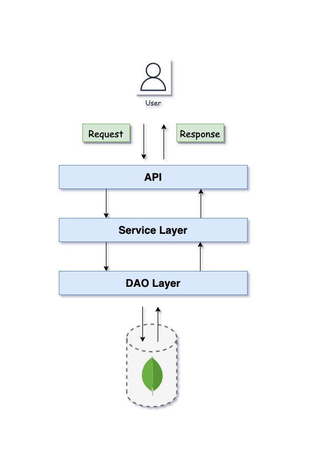

# Book Store :books:

``` 
Main target is to deliver books from its one centralized warehouse to their customers within the same day. 
That is why stock consistency is the first priority for their vision operations.
```

### Tech Stack & Patterns :dart:
* Java 17
* Spring Boot
* Maven
* MongoDB
* SLF4J
* Junit
* Docker
* Swagger
* Factory Pattern  
* CQRS Pattern

### Design :art:


### Build & Run :rocket:
``` 
docker-compose up -d --build && mvn --projects io.pera:book-store spring-boot:run
```

### Postman API :paperclip:
https://documenter.getpostman.com/view/2522238/UVkpMFHo

### Swagger UI :gift:
http://localhost:8080/swagger-ui/index.html

### License :key:
Distributed under the MIT License. See [LICENSE](LICENSE) for more information.